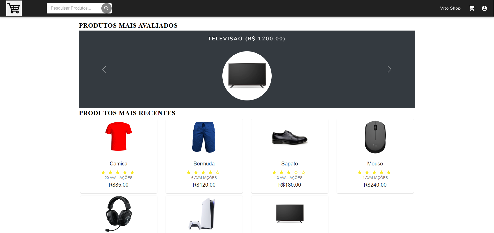
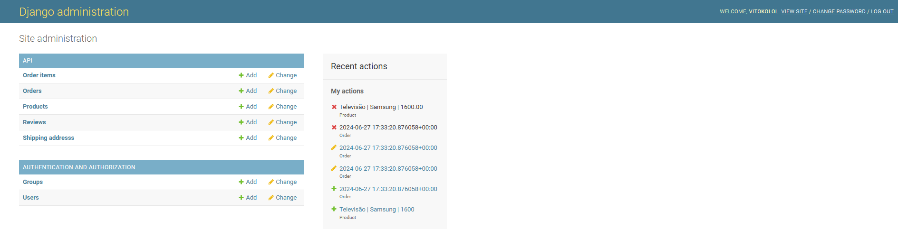

# Projeto E-commerce

### Introdução

#### Projeto demonstrativo para criação de um site e-commerce de produtos variados, gerenciado por um administrador, com integração de pagamentos via PayPal e cartão de crédito.

#### A aplicação foi desenvolvida utilizando Django no backend e React no frontend, com suporte a Nginx como servidor web e proxy reverso.

#### Para garantir portabilidade, consistência e facilidade de deploy, a aplicação é totalmente containerizada com Docker e orquestrada localmente com Docker Compose, permitindo que todos os serviços (frontend, backend, banco de dados e Nginx) sejam executados de forma integrada.

#### O projeto também foi preparado com foco em escalabilidade, sendo compatível com ambientes baseados em Kubernetes, facilitando o deploy em ambientes de produção distribuídos.

---

### Assista ao vídeo!

📹 [Assista à demonstração do projeto no YouTube](https://youtu.be/pp2hJ7Zvhzc?si=LTZP63bo3b81oEEy)


---


<p align="center">
  
</p>


<p align="center">
  
</p>

---

### Como utilizar o projeto

# E-commerce Django + React + Postgres

## Pré-requisitos

Antes de rodar o projeto, certifique-se de ter o Docker instalado na sua máquina.  
Você pode baixar o Docker Desktop aqui:  
[https://www.docker.com/products/docker-desktop/](https://www.docker.com/products/docker-desktop/)

---

## Setup Inicial

#### Clone o repositório:

```
git clone https://github.com/seuusuario/seuprojeto.git
cd seuprojeto
```

## Configurar arquivos de ambiente (.env)

O projeto utiliza arquivos .env para definir variáveis de ambiente tanto para o backend quanto para o frontend.

```
mv .env.example .env
mv frontend/.env.example frontend/.env
```

Edite os arquivos .env para configurar as variáveis conforme seu ambiente.


## Build e Start dos containers

Execute os comandos abaixo para construir as imagens e subir os containers em modo detached (em segundo plano):

```
docker-compose build
docker-compose up -d
```


## Verificar containers ativos

Verifique se os containers do backend, frontend e banco de dados estão rodando com:

```
docker ps
```

Você deve ver containers com nomes parecidos com:
- ecommerce-django-react-docker-web-1 (backend Django)
- ecommerce-django-react-docker-web-1 (frontend React)
- ecommerce-django-react-docker-web-1 (Postgres)


## Acessar os serviços

Abra seu navegador e acesse:

|Serviço           |URL                        |
|------------------|---------------------------|
|Frontend (React)  |http://localhost:3000      |
|Backend (Django)  |http://localhost:8000      |
|Admind Django     |http://localhost:8000/admin|


# Algumas Dicas Importantes

 - ### O arquivo entrypoint.sh do backend já tem permissão de execução garantida pelo Dockerfile. Caso você tenha problemas, confira isso.
 - ### Variáveis de ambiente são carregadas automaticamente pelo Docker Compose via .env.
 - ### Se fizer alterações no código backend ou frontend, pode ser necessário rebuildar as imagens com docker-compose build novamente.
 - ### Para parar os containers, use:
    ```
    docker-compose down
    ```


